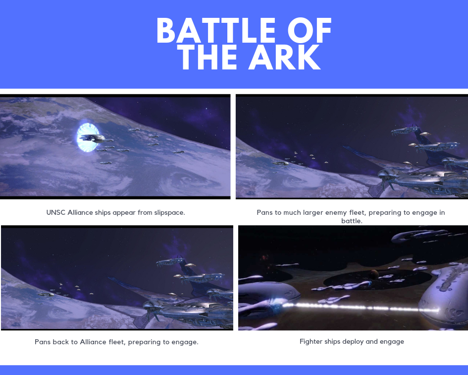
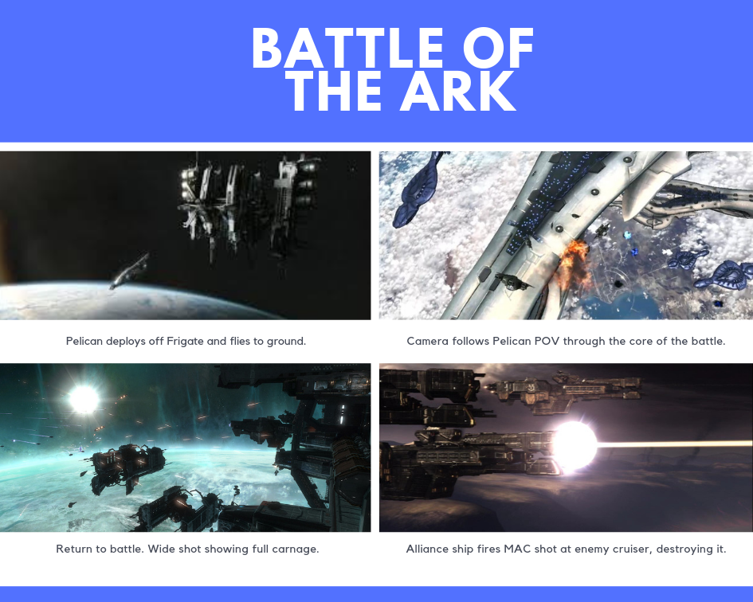
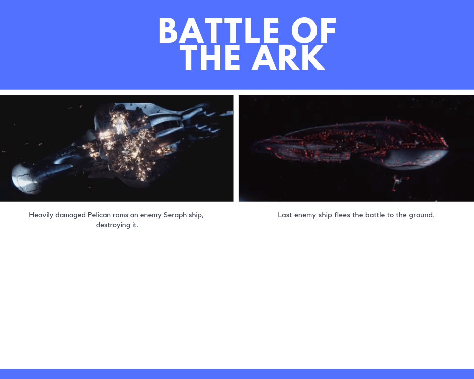

# SpaceBattle

## Description
The project has changed quite a bit from the original submission. When I started creating it I became more interested in creating an actual space ship dogfight simulation rather than putting togther a few set pieces of ships flying by and shooting at eachother as is in the original scene from Halo 3. Now the scene begins without the UNSC approaching the Covenant before both armys deploy their fighter ships. This is the real meat of the project.

The ships fly towards each other and engage in a dogfight with an enemy ship. When a ship destroys an enemy it then finds the closest enemy and starts attacking it. From this really cool scenes can emerge, with several banshees all puruseing a pelican.

## Instructions
The build will play a cutscene I created, and camera switching will be handled by scripts that detect which ships are in pursuit of a weak enemy and will follow them. In the Unity scene you can edit how many ships spawn in the UNSC Spawner and Covenant Spawner objects. You can also edit the size of the spawn area here also.

## How it works
Once the large ships reach a trigger, the fighter ships are spawned. This is using the ShipSpawning script for both sides. The area of the spawn size and amount of ships spawned are set here. Once the ships are spawned they are given an ID and Aggression Level. Their target is set as the ship on the opposing side with the same ID. There is one PelicanController script that is used for both sets of ships, just setting a bool depending on which side the ship belongs to. The StatenMachine on the ship switches to pursue, and once the ships are withing DisperseRange they will start to branch out. Once the ships are within Engagement Range the ship with the lower Agression Level will swith to its flee state.

The Pursuing ship will follow and shoot if the eemy is en front and within a certain distance. The fleeing ship will will with a NoiseWander behaviour active which will make it look like it is evading the purusing ship. When a ships target is the SelectTarget function will be called, which will assign the closet enemy as the new target. This will continue until one side is has no ships left.

## What I'm most proud of
I'm most proud of the ShipSpawning and the SelectTarget scripts as theyy lay the foundations for the dogfight mechanics. Im also proud of the PelicanController and that i got the one script to work with both ships. The logic in the Think method are the rules that make up the battle and were difficult to fine tune and even now need a lot of polish.
